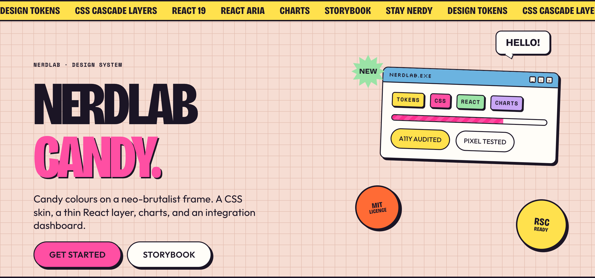
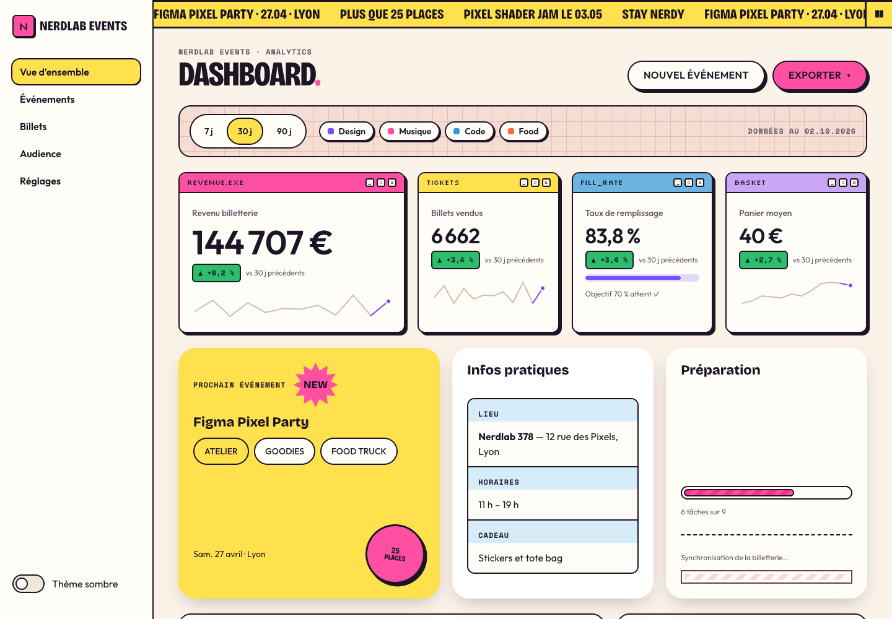
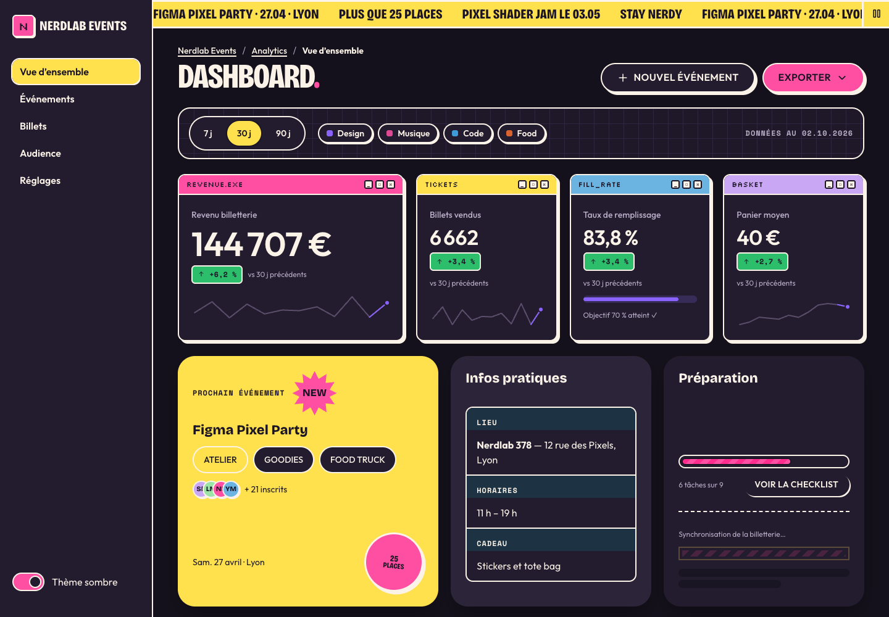
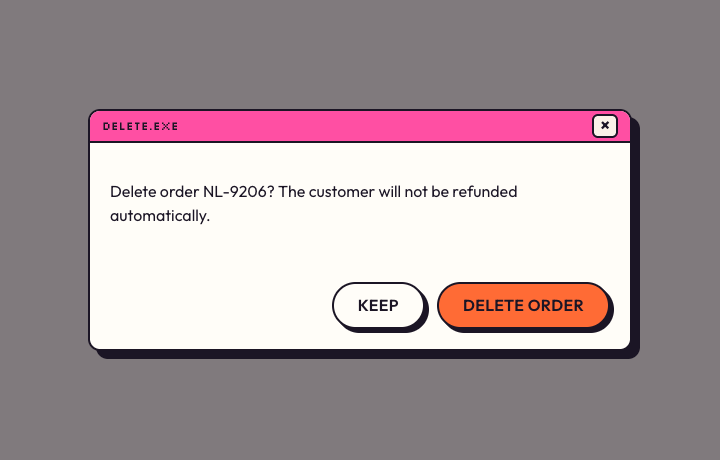
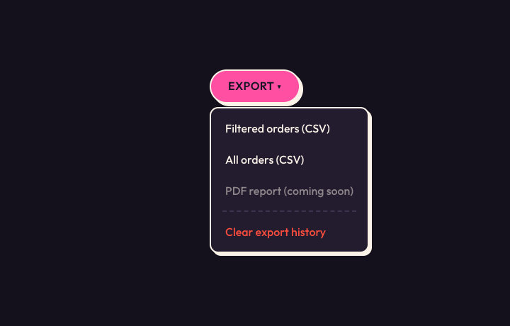
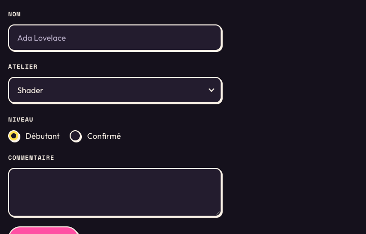
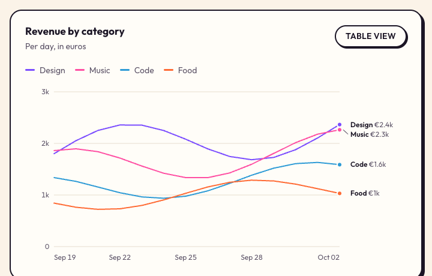
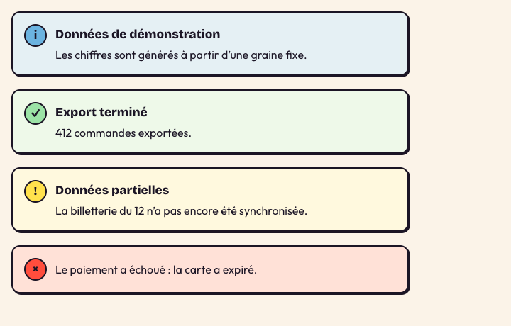
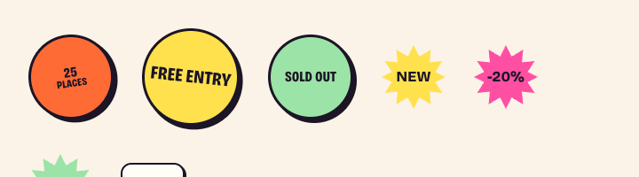
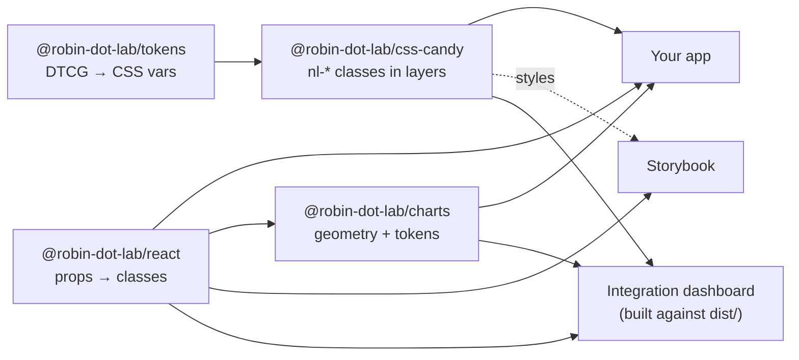

<p align="center">
  
</p>

<p align="center">
  <a href="https://github.com/robin-dot-lab/nerdlab-design-system/actions/workflows/ci.yml"></a>
  <a href="https://robin-dot-lab.github.io/nerdlab-design-system/"></a>
  <a href="https://robin-dot-lab.github.io/nerdlab-design-system/dashboard/"></a>
  
  
  <a href="https://github.com/robin-dot-lab/nerdlab-design-system/packages"></a>
  <a href="LICENSE"></a>
</p>

<p align="center">
  <b><a href="https://robin-dot-lab.github.io/nerdlab-design-system/">Storybook</a></b> ·
  <b><a href="https://robin-dot-lab.github.io/nerdlab-design-system/dashboard/">Live dashboard</a></b> ·
  <b><a href="#quick-start">Quick start</a></b> ·
  <b><a href="#components">Components</a></b> ·
  <b><a href="#contributing">Contributing</a></b>
</p>

---

**Nerdlab Candy** is the design system of Nerdlab: retro posters, Y2K operating-system windows and pixel art, turned into a production UI kit. Ink outlines, hard offset shadows, candy colours, and the discipline underneath: tokens, cascade layers, accessible components, tested pixel by pixel.

- 🎨 **CSS first.** The look lives in one framework-free stylesheet of `nl-*` classes. React only maps props to classes: no CSS-in-JS, no runtime styling cost, Server Components welcome.
- ♿ **Accessible by default.** Native elements where the platform is enough, [React Aria](https://react-spectrum.adobe.com/react-aria/) where it is not. Every story is audited with axe in light and dark themes, on desktop and phone.
- 🌗 **Dark theme and responsive** out of the box: fluid type, container queries, 44 px touch targets, `prefers-reduced-motion`.
- 📊 **Charts that follow the skin.** Geometry in React, every colour from tokens, a table view twin for every chart.
- 🧪 **Guarded.** Unit tests, kit integrity checks, pixel parity with the original design, visual regression of every story, Chrome, Firefox and WebKit.

## A look around

<table>
  <tr>
    <td width="50%"></td>
    <td width="50%"></td>
  </tr>
  <tr>
    <td align="center"><sub>The <a href="apps/dashboard">integration dashboard</a>, light</sub></td>
    <td align="center"><sub>…and dark, with one attribute: <code>data-theme="dark"</code></sub></td>
  </tr>
</table>

<table>
  <tr>
    <td width="33%"></td>
    <td width="33%"></td>
    <td width="33%"></td>
  </tr>
  <tr>
    <td align="center"><sub><code>Dialog</code> · <code>role="alertdialog"</code></sub></td>
    <td align="center"><sub><code>Menu</code> · keyboard and typeahead</sub></td>
    <td align="center"><sub><code>Select</code>, <code>RadioGroup</code>, <code>Textarea</code></sub></td>
  </tr>
  <tr>
    <td></td>
    <td></td>
    <td></td>
  </tr>
  <tr>
    <td align="center"><sub><code>LineChart</code> in a <code>ChartCard</code></sub></td>
    <td align="center"><sub><code>Callout</code> · tone said in words, not only colour</sub></td>
    <td align="center"><sub><code>Sticker</code>, <code>Burst</code>, <code>Bubble</code></sub></td>
  </tr>
</table>

## Packages

| Package | What it is | |
|---|---|---|
| [`@robin-dot-lab/tokens`](packages/tokens) | Design tokens in [DTCG](https://www.designtokens.org/) format, compiled by Style Dictionary to CSS variables, JS and JSON | `candy.css` · `candy` · `candy.json` |
| [`@robin-dot-lab/css-candy`](packages/css-candy) | The Candy skin: every `nl-*` class, in cascade layers `nl.tokens < nl.base < nl.components < nl.utilities` | `candy.css` · `fonts.css` |
| [`@robin-dot-lab/react`](packages/react) | 50+ typed React 19 components that only set classes | `import { Button } from '@robin-dot-lab/react'` |
| [`@robin-dot-lab/charts`](packages/charts) | Line, bars, heatmap, share bar, sparkline, chart card with legend and table twin | `import { LineChart } from '@robin-dot-lab/charts'` |

Published on **GitHub Packages**. Add the registry for the scope once, with a GitHub token that has `read:packages`:

```ini
# .npmrc
@robin-dot-lab:registry=https://npm.pkg.github.com
//npm.pkg.github.com/:_authToken=${GITHUB_TOKEN}
```

```bash
pnpm add @robin-dot-lab/css-candy @robin-dot-lab/react      # + @robin-dot-lab/charts for charts
```

Versions and changelogs are handled by [Changesets](.changeset/README.md).

## Quick start

```bash
git clone https://github.com/robin-dot-lab/nerdlab-design-system.git
cd nerdlab-design-system
pnpm install
pnpm build
pnpm storybook                         # http://localhost:6006
pnpm --filter @robin-dot-lab/dashboard dev   # http://localhost:5173
```

Requires Node 22+ and pnpm 11 (`corepack enable`).

### Use it in an app

```tsx
// 1. The skin, once, at the root of the app (fonts are a separate, optional import)
import '@robin-dot-lab/css-candy/fonts.css';
import '@robin-dot-lab/css-candy/candy.css';

// 2. Components
import { Button, Dialog, DialogActions, DialogTrigger, Window } from '@robin-dot-lab/react';

export function Welcome() {
  return (
    <Window>
      <Window.Bar color="primary">HELLO.EXE</Window.Bar>
      <Window.Body>
        <DialogTrigger>
          <Button variant="primary">Join the party</Button>
          <Dialog title="RSVP.EXE">
            {({ close }) => (
              <>
                <p>See you on the 27th, in Lyon.</p>
                <DialogActions><Button onClick={close}>Close</Button></DialogActions>
              </>
            )}
          </Dialog>
        </DialogTrigger>
      </Window.Body>
    </Window>
  );
}
```

No React? The classes work on plain HTML:

```html
<link rel="stylesheet" href="node_modules/@robin-dot-lab/css-candy/dist/candy.css">
<button class="nl-btn nl-btn--primary">Join the party</button>
<span class="nl-badge nl-badge--mint">New</span>
```

### Theme and overrides

```html
<html data-theme="dark">  <!-- dark theme: one attribute -->
```

```css
/* Your CSS wins over the kit without !important: everything in the kit lives in cascade layers,
   and unlayered rules beat layered ones. */
:root { --color-primary: #7B4DFF; }   /* re-brand a token */
.my-card { border-radius: 0; }        /* adjust one component */
```

## Components

| Family | Components |
|---|---|
| **Actions** | `Button` (8 variants, `asChild`), `Menu` · `MenuTrigger` · `MenuItem`, `Pagination`, `SegmentedControl`, `ToggleChip` |
| **Forms** | `Field`, `Input`, `Textarea`, `Select`, `RadioGroup` · `Radio`, `Checkbox`, `Switch`, `Search` |
| **Overlays** | `Dialog` · `DialogTrigger`, `Popover`, `Tooltip` |
| **Content** | `Window`, `Card`, `Bento`, `Callout`, `InfoList`, `Accordion`, `Tabs`, `DataTable` (sortable, stacks into cards on phones) |
| **Indicators** | `StatTile`, `Delta`, `Meter`, `Progress`, `Badge`, `Toast` |
| **Layout** | `Container`, `Section`, `Stack`, `Cluster`, `Grid`, `Split`, `VisuallyHidden`, `MobileNav` |
| **Personality** | `Sticker`, `Burst`, `Bubble`, `Pill`, `Ribbon` (pausable marquee), `Divider` |
| **Charts** | `LineChart`, `BarList`, `Heatmap`, `ShareBar`, `Sparkline`, `ChartCard`, `Legend` |

Every component has stories, props documentation and an accessibility audit in **[Storybook](https://robin-dot-lab.github.io/nerdlab-design-system/)**.

## How it fits together



The CSS is the source of truth; React never carries a colour, a length or a `style` prop. Interactive behaviour comes from the platform first (`<details>`, `<meter>`, `<select>`, radios), then React Aria (tabs, tooltip, dialog, popover, menu).

## Quality gates

`pnpm test` builds everything and runs, with no network access:

| Check | What it guarantees |
|---|---|
| Unit tests (Vitest, Testing Library) | Behaviour, ARIA, keyboard of every component |
| Kit integrity | Every component has a story and a test; every class it uses exists in the skin |
| Code guards | No colour, length or `style` in React; `'use client'` exactly where needed |
| Token and pixel parity | The skin renders the original Candy design pixel for pixel, except declared, documented fixes |
| Accessibility audit | axe on every story, light and dark, 1280 and 390 px, including open dialogs and menus |
| Visual regression | Every story compared with its committed screenshot (desktop light, phone dark) |
| Cross-browser | Every story in Firefox and WebKit: renders, no console error, axe clean |
| Dashboard end-to-end | 50+ checks: real journeys, keyboard, focus return, theme switch, three engines |

CI runs the same checks on every push and pull request, spread over eight parallel jobs (under 5 minutes).

## Contributing

```bash
pnpm new:component Gizmo          # scaffolds CSS, component, test, story and export
pnpm test                         # must be green
pnpm changeset                    # describe the change for the changelog
```

The rules (and the test that enforces each of them) are in [`AGENTS.md`](AGENTS.md), written for humans and coding agents alike. An intended visual change? Update the screenshots with `pnpm --filter @robin-dot-lab/docs visual:update` and commit them; CI keeps its own Linux set, refreshed by the *Update visual baselines* workflow.

## Licence

[MIT](LICENSE) © Nerdlab. Fonts are loaded from Google Fonts under the SIL Open Font Licence.
