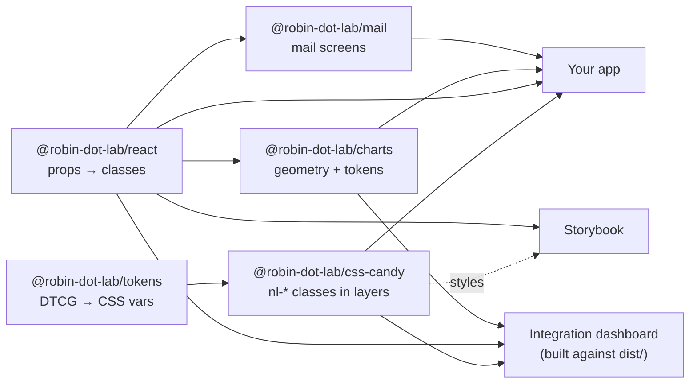

<p align="center">
  
</p>

<p align="center">
  <a href="https://github.com/robin-dot-lab/nerdlab-design-system/actions/workflows/ci.yml"></a>
  <a href="https://robin-dot-lab.github.io/nerdlab-design-system/"></a>
  <a href="https://robin-dot-lab.github.io/nerdlab-design-system/dashboard/"></a>
  
  
  <a href="https://github.com/robin-dot-lab/nerdlab-design-system/packages"></a>
  <a href="LICENSE"></a>
</p>

<p align="center">
  <b><a href="https://robin-dot-lab.github.io/nerdlab-design-system/">Storybook</a></b> ·
  <b><a href="https://robin-dot-lab.github.io/nerdlab-design-system/dashboard/">Live dashboard</a></b> ·
  <b><a href="#quick-start">Quick start</a></b> ·
  <b><a href="#components">Components</a></b> ·
  <b><a href="#contributing">Contributing</a></b>
</p>

---

**Nerdlab Candy** is the design system of Nerdlab: retro posters, Y2K operating-system windows and pixel art, turned into a production UI kit. Ink outlines, hard offset shadows, candy colours, and the discipline underneath: tokens, cascade layers, accessible components, tested pixel by pixel.

- 🎨 **CSS first.** The look lives in one framework-free stylesheet of `nl-*` classes. React only maps props to classes: no CSS-in-JS, no runtime styling cost, Server Components welcome.
- ♿ **Accessible by default.** Native elements where the platform is enough, [React Aria](https://react-spectrum.adobe.com/react-aria/) where it is not. Every story is audited with axe in light and dark themes, on desktop and phone.
- 🌗 **Dark theme and responsive** out of the box: fluid type, container queries, 44 px touch targets, `prefers-reduced-motion`.
- 📊 **Charts that follow the skin.** Geometry in React, every colour from tokens, a table view twin for every chart.
- 🧪 **Guarded.** Unit tests, kit integrity checks, pixel parity with the original design, visual regression of every story, Chrome, Firefox and WebKit.

## A look around

<table>
  <tr>
    <td width="50%"></td>
    <td width="50%"></td>
  </tr>
  <tr>
    <td align="center"><sub>The <a href="apps/dashboard">integration dashboard</a>, light</sub></td>
    <td align="center"><sub>…and dark, with one attribute: <code>data-theme="dark"</code></sub></td>
  </tr>
</table>

<table>
  <tr>
    <td width="33%"></td>
    <td width="33%"></td>
    <td width="33%"></td>
  </tr>
  <tr>
    <td align="center"><sub><code>Dialog</code> · <code>role="alertdialog"</code></sub></td>
    <td align="center"><sub><code>Menu</code> · keyboard and typeahead</sub></td>
    <td align="center"><sub><code>Select</code>, <code>RadioGroup</code>, <code>Textarea</code></sub></td>
  </tr>
  <tr>
    <td></td>
    <td></td>
    <td></td>
  </tr>
  <tr>
    <td align="center"><sub><code>LineChart</code> in a <code>ChartCard</code></sub></td>
    <td align="center"><sub><code>Callout</code> · tone said in words, not only colour</sub></td>
    <td align="center"><sub><code>Sticker</code>, <code>Burst</code>, <code>Bubble</code></sub></td>
  </tr>
</table>

## Packages

| Package | What it is | |
|---|---|---|
| [`@robin-dot-lab/tokens`](packages/tokens) | Design tokens in [DTCG](https://www.designtokens.org/) format, compiled by Style Dictionary to CSS variables, JS and JSON, for both skins | `candy.css` · `bento.css` · `candy` · `bento` |
| [`@robin-dot-lab/css-candy`](packages/css-candy) | The Candy skin: every `nl-*` class, in cascade layers `nl.tokens < nl.base < nl.components < nl.utilities` | `candy.css` · `fonts.css` |
| [`@robin-dot-lab/css-bento`](packages/css-bento) | The Bento skin: the same classes, sober — tonal tiles, pills, no outlines. Import it instead of Candy | `bento.css` · `fonts.css` |
| [`@robin-dot-lab/react`](packages/react) | 80+ typed React 19 components that only set classes | `import { Button } from '@robin-dot-lab/react'` |
| [`@robin-dot-lab/charts`](packages/charts) | Line, bars, heatmap, share bar, sparkline, chart card with legend and table twin | `import { LineChart } from '@robin-dot-lab/charts'` |
| [`@robin-dot-lab/icons`](packages/icons) | 44 inline SVG icons, 2px strokes in `currentColor`, sized by the skin | `import { Calendar } from '@robin-dot-lab/icons'` |
| [`@robin-dot-lab/mail`](packages/mail) | Mail screens: message list, sandboxed email viewer, attachments, disposable-address card | `import { MessageList } from '@robin-dot-lab/mail'` |

Published on **GitHub Packages**. Two lines of configuration, in two places:

```ini
# .npmrc in your project (commit it): where the scope lives
@robin-dot-lab:registry=https://npm.pkg.github.com
```

```ini
# ~/.npmrc, your user-level config (never commit it): a GitHub token with the read:packages scope
//npm.pkg.github.com/:_authToken=${GITHUB_TOKEN}
```

pnpm 11 ignores tokens read from environment variables in a project `.npmrc` (a committed file could leak them), hence the user-level file; `pnpm config set "//npm.pkg.github.com/:_authToken" <token>` works too. pnpm also holds back versions published less than a day ago (`minimumReleaseAge`): right after a release, ask for the version explicitly (`pnpm add @robin-dot-lab/react@1.0.0-rc.0`). Release candidates are published under the `rc` dist-tag (`pnpm add @robin-dot-lab/react@rc`).

```bash
pnpm add @robin-dot-lab/css-candy @robin-dot-lab/react      # + @robin-dot-lab/charts, @robin-dot-lab/icons, @robin-dot-lab/mail
pnpm add @robin-dot-lab/tokens                             # only to list the palettes (palettes.json) in a picker
```

Versions and changelogs are handled by [Changesets](.changeset/README.md).

## Quick start

```bash
git clone https://github.com/robin-dot-lab/nerdlab-design-system.git
cd nerdlab-design-system
pnpm install
pnpm build
pnpm storybook                         # http://localhost:6006
pnpm --filter @robin-dot-lab/dashboard dev   # http://localhost:5173
```

Requires Node 22+ and pnpm 11 (`corepack enable`).

### Use it in an app

```tsx
// 1. The skin, once, at the root of the app (fonts are a separate, optional import)
import '@robin-dot-lab/css-candy/fonts.css';
import '@robin-dot-lab/css-candy/candy.css';

// 2. Components
import { Button, Dialog, DialogActions, DialogTrigger, Window } from '@robin-dot-lab/react';

export function Welcome() {
  return (
    <Window>
      <Window.Bar color="primary">HELLO.EXE</Window.Bar>
      <Window.Body>
        <DialogTrigger>
          <Button variant="primary">Join the party</Button>
          <Dialog title="RSVP.EXE">
            {({ close }) => (
              <>
                <p>See you on the 27th, in Lyon.</p>
                <DialogActions><Button onClick={close}>Close</Button></DialogActions>
              </>
            )}
          </Dialog>
        </DialogTrigger>
      </Window.Body>
    </Window>
  );
}
```

### Language and formats

The kit's own words (close buttons, pagination, the tone said before a callout, empty tables…) and its number and date formats follow [React Aria's locale](https://react-spectrum.adobe.com/react-aria/internationalization.html). Without a provider that is the browser's language; set it once at the root:

```tsx
import { I18nProvider } from '@robin-dot-lab/react';

<I18nProvider locale="fr-FR"><App /></I18nProvider>   // French words, « 12,5 % », 27/04/2026
```

French locales get French words, every other locale English ones, each with its own formats. Any word can still be replaced by a prop (`closeLabel`, `labels`, `emptyLabel`…).

### Server Components

The packages work in a React Server Component tree (Next.js App Router) with no wrapper of your own: modules that need the client say `'use client'` themselves, and static components stay server-rendered. Two limits of the platform: props that are functions (`onPageChange`, render-prop children) and class instances (a `DatePicker`'s `CalendarDate` value) cannot cross from a server component to a client one, so set those from a client component. Both a Vite app and a Next.js app are built and checked against the packed packages in CI (`tools/consumer-check`).

No React? The classes work on plain HTML:

```html
<link rel="stylesheet" href="node_modules/@robin-dot-lab/css-candy/dist/candy.css">
<button class="nl-btn nl-btn--primary">Join the party</button>
<span class="nl-badge nl-badge--mint">New</span>
```

### Palettes

Seven colour palettes, each with a light and a dark theme, all contrast-checked: **Candy** (the default, candy colours), **Sorbet** (powdery pastels), **Ink** (sober black, white and brick), **Terracotta** (warm earth), **Slate** (navy and bright blue), **Moss** (greens and mustard) and **Mono Retro** (a phosphor-green terminal). Pick one with an attribute, on `<html>` or on any container:

```html
<html data-palette="sorbet" data-theme="dark">
```

The list is exported as `@robin-dot-lab/tokens/palettes.json` (`id`, `name`, `description`) to build a picker; add `@robin-dot-lab/tokens` to your dependencies to import it (with pnpm, a dependency of a dependency is not importable). Every palette passes the same checks: text 4.5:1 on every background and fill, lines and focus rings 3:1, chart colours distinct for colour-blind readers.

### Theme and overrides

```html
<html data-theme="dark">  <!-- dark theme: one attribute; "auto" follows the device, "light" is the default -->
```

```css
/* Your CSS wins over the kit without !important: everything in the kit lives in cascade layers,
   and unlayered rules beat layered ones. */
:root { --color-primary: #7B4DFF; }   /* re-brand a token */
.my-card { border-radius: 0; }        /* adjust one component */
```

## Components

| Family | Components |
|---|---|
| **App frame** | `AppShell` (with a skip link), `Sidebar` · `SidebarSection` · `SidebarItem` (collapsible), `Topbar`, `AuthLayout`, `Banner` |
| **Public pages** | `SiteHeader`, `SiteFooter`, `Band` (hero, feature row, final call) |
| **Actions** | `Button` (8 variants, `asChild`, `loading`), `CopyButton`, `Menu` · `MenuTrigger` · `MenuItem`, `Pagination`, `SegmentedControl`, `ToggleChip` |
| **Forms** | `Field`, `Input`, `PasswordInput` (show / hide, strength), `InputGroup` · `InputAddon`, `Textarea`, `Select`, `ComboBox`, `DatePicker`, `OTPInput`, `RadioGroup` · `Radio`, `Checkbox`, `Switch`, `Search` |
| **Overlays** | `Dialog` · `DialogTrigger`, `Drawer`, `Popover`, `Tooltip` |
| **Content** | `Window`, `Card`, `Bento`, `Callout`, `InfoList`, `Accordion`, `Tabs`, `DataTable` (sortable, selectable, stacks into cards on phones), `CopyField`, `CodeBlock`, `Kbd`, `QRCode`, `EmptyState` |
| **Indicators** | `StatTile`, `Delta`, `Meter`, `Progress`, `Skeleton`, `Spinner`, `Badge`, `Toast`, `StatusDot`, `RelativeTime`, `ExpiryIndicator` |
| **Navigation and people** | `Breadcrumb`, `MobileNav`, `Avatar`, `AvatarGroup` |
| **Layout** | `Container`, `Section`, `Stack`, `Cluster`, `Grid`, `Split`, `VisuallyHidden` · classes `.nl-display--sm…xl`, `.nl-headline--sm…xl` (fluid title sizes), `.nl-break-anywhere` (long addresses, tokens, URLs) |
| **Personality** | `Sticker`, `Burst`, `Bubble`, `Pill`, `Ribbon` (pausable marquee), `Divider` |
| **Charts** | `LineChart`, `BarList`, `Heatmap`, `ShareBar`, `Sparkline`, `ChartCard`, `Legend` |
| **Icons** | 44 icons: arrows and chevrons, check, close, plus, minus, search, menu, info, warning, error, success, calendar, user, filter, sort, play, pause, copy, eye, mail, inbox, paperclip, download, trash, files by type, code, clock… |
| **Mail** | `MessageList` · `MessageListItem`, `MessageHeader`, `EmailViewer` (sandboxed, remote images blocked until asked), `AttachmentChip` · `AttachmentList`, `AddressCard` |

Every component has stories, props documentation and an accessibility audit in **[Storybook](https://robin-dot-lab.github.io/nerdlab-design-system/)**.

## How it fits together



The CSS is the source of truth; React never carries a colour, a length or a `style` prop. Interactive behaviour comes from the platform first (`<details>`, `<meter>`, `<select>`, radios), then React Aria (tabs, tooltip, dialog, drawer, popover, menu, combobox, date picker).

## Quality gates

`pnpm test` builds everything and runs, with no network access:

| Check | What it guarantees |
|---|---|
| Unit tests (Vitest, Testing Library) | Behaviour, ARIA, keyboard of every component |
| Kit integrity | Every component has a story and a test; every class it uses exists in the skin |
| Public API | Every export, class, CSS variable and palette listed in `api-surface.txt`: removing one fails until a major version |
| Code guards | No colour, length or `style` in React; `'use client'` exactly where needed |
| Token and pixel parity | The skin renders the original Candy design pixel for pixel, except declared, documented fixes |
| Accessibility audit | axe on every story, light and dark, 1280 and 390 px, including open dialogs and menus |
| Forced colours | Every story in Windows high-contrast mode: marks, data, selected states and focus rings stay visible |
| Visual regression | Every story compared with its committed screenshot (desktop light, phone dark) |
| Cross-browser | Every story in Firefox and WebKit: renders, no console error, axe clean |
| Dashboard end-to-end | 60+ checks: real journeys, keyboard, focus return, theme switch, three engines |

CI runs the same checks on every push and pull request, spread over 16 parallel jobs, including an accessibility audit of every story in each palette and the packed packages installed into a blank Vite app and a Next.js App Router app.

## Contributing

```bash
pnpm new:component Gizmo          # scaffolds CSS, component, test, story and export
pnpm test                         # must be green
pnpm changeset                    # describe the change for the changelog
```

The rules (and the test that enforces each of them) are in [`AGENTS.md`](AGENTS.md), written for humans and coding agents alike. An intended visual change? Update the screenshots with `pnpm --filter @robin-dot-lab/docs visual:update` and commit them; CI keeps its own Linux set, refreshed by the *Update visual baselines* workflow.

## Licence

[MIT](LICENSE) © Nerdlab. Fonts are loaded from Google Fonts under the SIL Open Font Licence.
